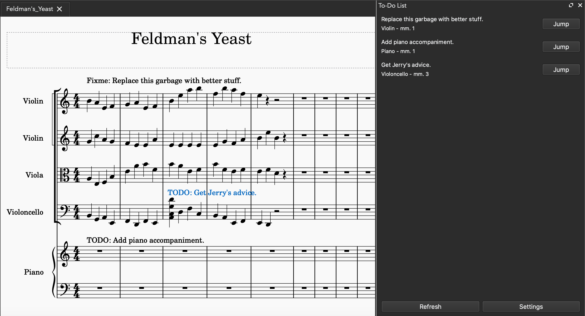

# musescore-todo-list
A todo-list plugin for MuseScore. You can never have too many todos.

In short this plugin helps you:

* Organise your score editing workflow.
* Find `TODO`s and `FIXME`s easily.
* Navigate to the points of trouble without hassle—well, except having to insert text at said points in the first place.

In software development, todos are commonly added to source code as reminders to the poor developers toiling away writing code. Todos come in many forms: bugs to be fixed, issues to be resolved, feature requests, etc. Sometimes when composing, one may also find oneself lost in a sea of todos, struggling to remember what one wanted to change in a particular measure. 

Examples of todos:

* TODO: Explore different chord progressions for this transition.
* TODO: More brass to this section.
* FIXME: Playback sounds wonky.
* TODO: Revise counterpoint.
* TODO: Add bowing articulation to strings.
* TODO: Confirm with friend if this part is playable.

This plugin aims to increase the quality of life of composers, arrangers, transcribers, and well—anybody who edits scores. The typical usage would be to add `TODO`s/`FIXME`s as staff text via <kbd>Ctrl</kbd>+<kbd>T</kbd> or <kbd>Cmd</kbd>+<kbd>T</kbd>, noting down your thoughts and ideas before they disappear. The plugin will then automatically refresh and display the curated list of `TODO`s on a dock.

The plugin is configurable in multiple ways:

* **Continuous Refresh**. Set true for the plugin to update the to-do list whenever the score is updated. May be slow for humongous scores.
* **Filter Regex**. A [regular expression][regex] to filter text elements. Case-insensitive. By default, the regex is `^(todo|fixme)`. This matches texts that start with `todo` or `fixme`.
* **Filter Case Sensitivity**. Whether the matching should be case-sensitive.
* **Filter Elements**. The MuseScore Element Types to filter. By default, only Staff Text (42) and System Text (43) are filtered.

For reference, here's a list of text element types from the MuseScore API:

| Type | Name   |
|------|--------|
| 41   | Tempo Text |
| 42   | Staff Text |
| 43   | System Text |
| 44   | Rehearsal Mark |
| 45   | Instrument Change |
| 46   | Staff Type Change |

(Todos in lyrics are currently not supported.)

This plugin should (in theory) work in MuseScore versions 3.5 and up.

### Development
Pull requests, translations, and bug reports are welcome.

[regex]: https://www.regular-expressions.info/
